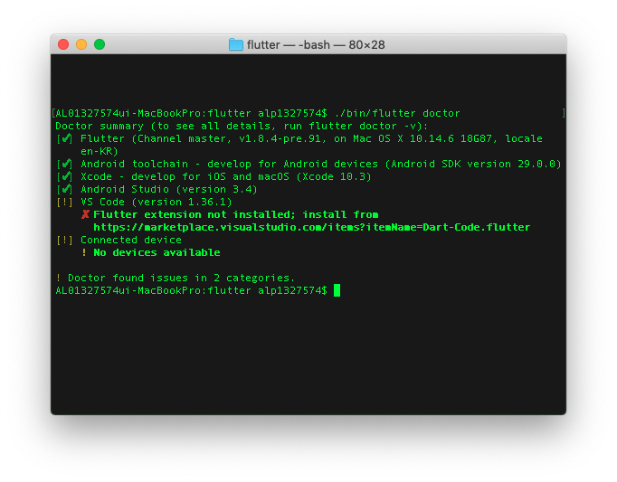
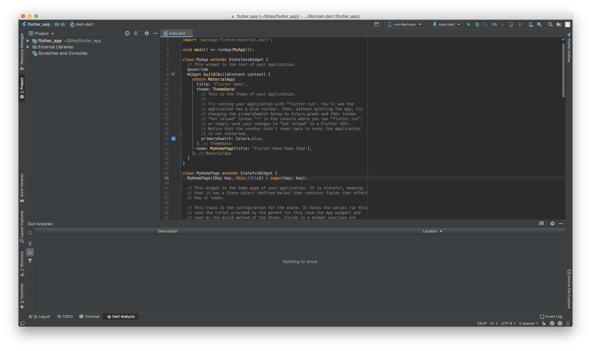

# Windows 개발 환경 설정 

윈도우즈 개발 환경은 아래와 같이 설정합니다.

- [x] 1. Flutter SDK는 Github에서 다운로드 받습니다. 
- [ ] 2. `flutter doctor` 를 실행합니다. 
- [ ] 3. Android Studio에서 해당 path를 지정하고, 프로젝트를 시작합니다.

> Flutter를 직접 사용하기 위해서 글로벌 Path를 추가하는 방법은 본 수업에서는 사용하지 않습니다. 
>
> 조금 불편하지만 직접 폴더에 들어가서 입력하는 방법을 사용하겠습니다. 

## 1. Flutter SDK

- 이미 여기까지는 모든 맴버들이 완료된 것으로 알고 있습니다.

## 2. `flutter doctor` 를 실행합니다. 

- Github에서 우클릭을 하고 `Terminal` 을 실행합니다. 
- 검은 터미널 화면에 `./bin/flutter doctor` 를 입력합니다. 
- `[v] Flutter` 라는 초록색 글씨가 있으면 인스톨 성공입니다. (나머지는 다음에 설정하면 됩니다.)

## 3. Android Studio에서 해당 path를 지정하고, 프로젝트를 시작합니다.

- 이제 다시 Android Studio를 켜서 아까 진행하던 path를 다시 설정합니다. 

- 정상적으로 실행되는지 확인합니다. 

  
  
