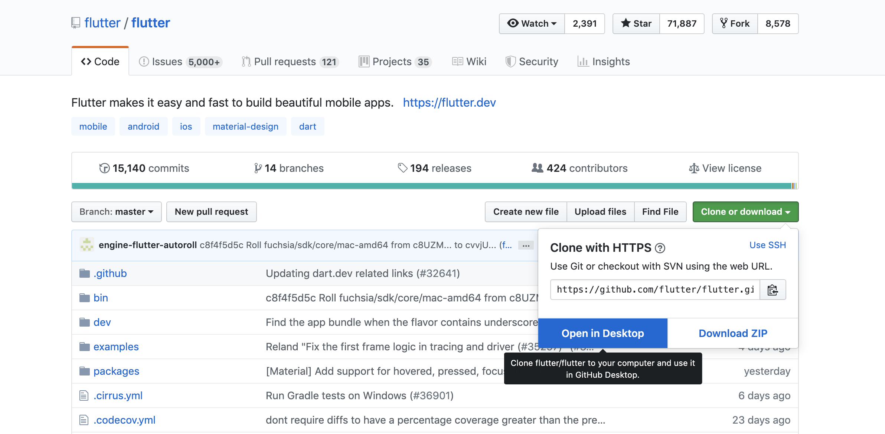
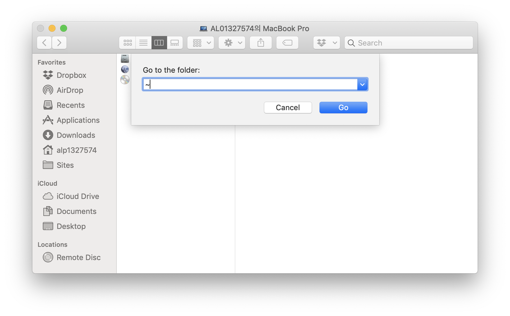
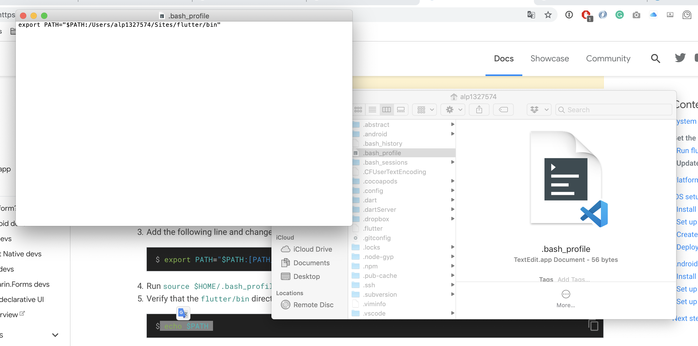

```
title: 1: Flutter 설치
data: 2019-08-05
```


첫시간 자료: https://medium.com/flutter-guidelines-kr/get-started-with-flutter-9703c3f6bd4f

# 이번주 할일

[TOC]


## 아래 ~~3~~ 4가지를 다운로드


### 0. Macbook user 의 사전 준비

- [Xcode](https://itunes.apple.com/us/app/xcode/id497799835)
- [Home-brew ](https://brew.sh/index_ko)

맥북을 사용하는 분들은 반드시 설치해야하는 것입니다. 
Xcode는 용량이 많고, 다운로드가 느리니 수업전에 미리 받아오시면 좋습니다. (안 받고 오셔도 상관은 없습니다.)

- Homebrew

이른바 개발자를 위한 App store 입니다. 각종 개발툴이나 패키지는 물론 font나 App 자체를 설치하는 것( cask)도 지원합니다. 한번 빠지면 헤어나오지 못합니다. 


```
/usr/bin/ruby -e "$(curl -fsSL https://raw.githubusercontent.com/Homebrew/install/master/install)"

```


### 1. Github for Desktop

- [Github for Desktop](https://desktop.github.com/)

앞으로 진행할 수업의 대부분을 Github의 수업자료를 사용하므로 GITHUB를 사용하는 것이 필수입니다. 또한 본 수업이 비개발자 및 디자이너를 위한 Flutter 스터디이므로 가장 단순한 `Github-desktop`을 기준으로 자료를 작성했습니다. 

본인이 GIT에 익숙하다면  SourceTree 등 다른 클라이언트를 사용하거나 CLI를 사용해도 괜찮습니다. 환영합니다 :)

### 2. Flutter SDK 다운로드

- [Download](https://flutter.dev/docs/development/tools/sdk/releases)
- [공식 가이드]( https://flutter.dev/docs/get-started/install?source=post_page---------------------------)
- [한글버전](https://flutter-ko.dev/docs/get-started/install/windows)

다음으로는 Flutter와 DART SDK를 설치해야 합니다. 공식 가이드에서 제공하는 방법을 사용하거나 Github에서 직접 Clone 받아서 사용하는 것 모두 가능합니다. 

우리는 매주 월요일 Flutter, 금요일에 Git을 공부하는 `병행 학습`이므로 Git을 이용해서 설치해보겠습니다. 




또는 

```cli
 git clone -b master https://github.com/flutter/flutter.git
```

### 3. Android Studio Download

다음으로는 안드로이드 스튜디오를 다운로드 합니다. 시간이 상당히 오래걸리기 때문에 느긋하게 기다립니다. 

- [Android Studio](https://developer.android.com/studio/?gclid=CjwKCAjwpuXpBRAAEiwAyRRPgexceWZVUlLma9Ur1SYHy27g8hkkjhaKw_bUshKFL7DjELL06GVY9hoCJwoQAvD_BwE)

또는 
```cli
brew cask install android-studio
```

---

> 물론 본인이 무거운 에디터를 원하지 않는다면. VSCode를 사용하는 것도 가능합니다. 
> ```cli
> brew cask install visual-studio-code
> ```

### 4. Setting 시작 !

> - 조은 님 블로그 자료: https://medium.com/flutter-guidelines-kr/get-started-with-flutter-9703c3f6bd4f

자, 이제 시작입니다. 조은님의 블로그 자료를 바탕으로 안드로이드 스튜디오 및 Flutter 개발 세팅을 시작합니다.
만약 이 과정에서 문제가 있다면 아마 Path 설정일 것입니다. 아예.. 아무것도 설정한 적이 없는 맥북을 기준으로 설정 방법은 아래와 같습니다.

### 5. PATH

#### MAC OS
혹시 본인이 Terminal을 조금 더 선호하신다면 아래 경로를 통해서 PATH를 설정하실 수 있습니다. 

* `sudo vi /.bash_profile` // password needed
* `export PATH="$PATH:[PATH_TO_FLUTTER_GIT_DIRECTORY]/flutter/bin` // Add line
* `echo $PATH`// Test

아직 터미널이 외계어처럼 느껴지신다면 아래 GUI를 따라서 실행하실 수 있습니다.

1) Finder를 실행하고 ` CMD + SHIFT + G` 를 입력합니다.

2) `~` 로 이동합니다. ($HOME 입니다.)

3) `CMD + SHIFT + .` 를 입력해서 숨긴 파일을 모두 표시합니다.

4) `.bash_profile` 파일이 있다면 거기에 PATH를 추가합니다. 없다면 새로운 파일을 만들어서 추가합니다







#### 5. Hello, world

> - https://codelabs.developers.google.com/codelabs/first-flutter-app-pt1/index.html?index=..%2F..index#0

```flutter
import 'package:flutter/material.dart';

void main() => runApp(MyApp());

class MyApp extends StatelessWidget {
  @override
  Widget build(BuildContext context) {
    return MaterialApp(
      title: 'Welcome to Flutter',
      home: Scaffold(
        appBar: AppBar(
          title: const Text('Welcome to Flutter'),
        ),
        body: const Center(
          child: const Text('Hello World'),
        ),
      ),
    );
  }
}
```
