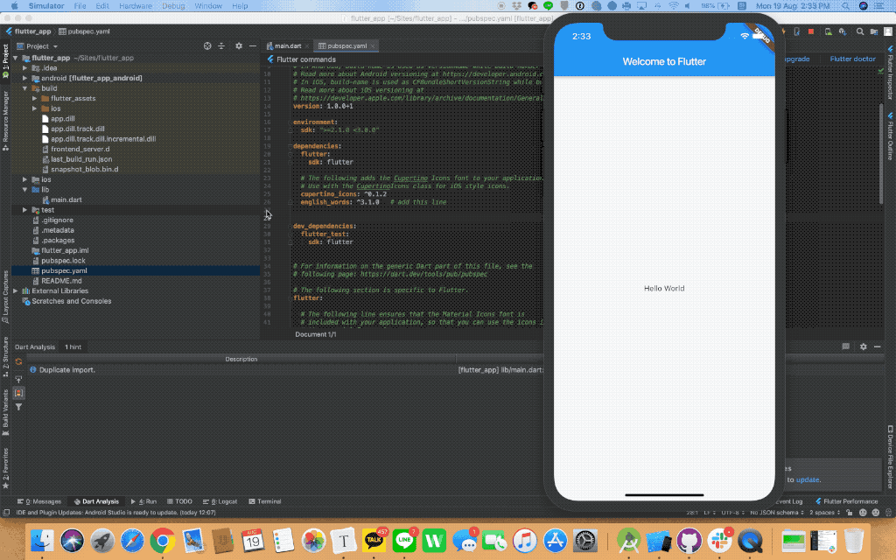

# 이번주 할일

Google Code Lab `Write Your First Flutter App, part 1`을  따라해보고 해석해보면서 Flutter의 기본을 익혀봅시다. 코드랩의 설명을 기준으로 중간 중간 Google Developer Expert로 활중 중이신 조은님의 블로그 내용을 바탕으로 설명을 추가했습니다. 

**참고 자료**

> [https://codelabs.developers.google.com/codelabs/first-flutter-app-pt1/index.html](https://codelabs.developers.google.com/codelabs/first-flutter-app-pt1/index.html?index=..%2F..index#2)


## 사전 준비 

- [x] 개발 환경 설정 완료
- [x] 애뮬레이터 설정 완료 및 `Run` 성공하기 

## 1. 시작하기

이번 예제는 Startup-Namer 라는 앱을 만들 것 입니다. 먼저 "New Flutter Project" 로 프로젝트를 생성하고, 각자의 애뮬레이터를 실행해서 준비를 해주십시오. 

다음으로는  `lib/main.dart`를 모두 지우고 아래의 코드를 붙여넣기를 후 Hot Reload로 화면이 어떻게 바뀌었는지 확인해주십시오. 

> 조은님의 블로그에서 찾은 몇몇 한글 설명을 더 추가했습니다. 

```dart
// Flutter에서 사용하는 기초 라이브러리를 불러옵니다.
import 'package:flutter/material.dart';

// 모든 Flutter 앱은 기본적으로 main을 하나 가져야합니다.
void main() {
  // Flutter의 Widget의 최상위 트리를 나타내는 함수입니다.
  // 함수의 인수로 Widget을 전달합니다.
  runApp(MyApp());
}

// 여타 객체지향 언어가 그러하듯 Dart에서도 Class를 지원합니다. 여러 class를 하나로 묶어서 하나의 어플리케이션을 구성한다고 생각하시면 편합니다.

class MyApp extends StatelessWidget {

//이 경우 MyApp은 Flutter의 StatelessWidget 을 상속받아서 구현한 것이며, StatelessWidget 이 가지고 있던 Widget 을 override하고 있습니다. 지금 모든 것을 이해할 필요는 없습니다. (어려운 게 정상입니다)

  @override
  Widget build(BuildContext context) {
  // 위젯을 생성
  
    return MaterialApp(
      title: 'Welcome to Flutter',
      home: Scaffold(
        appBar: AppBar(
          title: const Text('Welcome to Flutter'),
        ),
        body: const Center(
          child: const Text('Hello World'),
        ),
      ),
    );
    
 // MyApp이 리턴하는 것은 Title이 'Welcome to Flutter'이고 appBar와 Body를 가지고 있는 함수
//앞으로 이제 밥먹듯이 사용될 예정이니 Class 문법은 천천히 익숙해지도록 합시다.

  }
}
```

**성공**
화면에 Hello world 가 뜨는 상태이면 성공입니다.


## 2. 외부 라이브러리 설치하기

다음 작업으로 수천개의 영단어와 몇몇 기능(function)을 가지고 있는  [english_words](https://pub.dartlang.org/packages/english_words)라는 오픈소스 패키지를 설치해서 앱에 추가해보겠습니다. 


**Step 1**: **pubspec.yaml**

pubspec.yaml 파일을 찾아서 아래 항목을 추가합니다.

다음으로 안드로이드 스튜디오 우측 상단에 있는 pkg get 버튼을 눌러서 패키지를 설치합니다. 

```
dependencies:
  flutter:
    sdk: flutter

  cupertino_icons: ^0.1.2
  english_words: ^3.1.0   # add this line
```


>  **코드 붙여넣기 팁** 
>
> 우리가 학습하는 Google CodeLab의 코드는 여러분의 복사 붙여넣기를 응원합니다!
>
> 코드랩의 샘플 코드를 보면 위와 같이 `# add this line` 형태로 앞으로 우리가 무엇을 해야하는지를 잘 설명해주고 있습니다. 그래서 해당 라인의 앞/뒤 코드를 잘 찾아서 복사/붙여넣기를 하시면 초보자도 손쉽게 따라하실 수 있습니다.
>
> 


**Step2: 라이브러리로 코드 개선하기 **


```dart
import 'package:flutter/material.dart';

// 새로 설치한 패키지를 가져옵니다. 
import 'package:english_words/english_words.dart';

void main() => runApp(MyApp());

class MyApp extends StatelessWidget {
  @override
  Widget build(BuildContext context) {
  // 새로 추가한 라인
  // 영어단어를 랜덤으로 두개씩 짝을 지어서 만들어줍니다. (WordPair)
  // WordPair는 우리가 설치한 english_words 의 기능 중 하나입니다. 
    final wordPair = WordPair.random(); 
    
    return MaterialApp(
      title: 'Welcome to Flutter',
      home: Scaffold(
        appBar: AppBar(
          title: Text('Welcome to Flutter'),
        ),
        body: Center(
          //child: Text('Hello World'),   // 그냥 Hello World를 표시하던 것을 지우고
          // 아까 위에서 만든 WordPair를 Pascal Case로 표시해줍니다. 
          // Pascal Case 말고도 CamelCase 등등 여러가지 조합을 만들 수 있습니다. 
          child: Text(wordPair.asPascalCase),  
          
        ),
      ),
    );
  }
}
```

**성공**
화면에 랜덤의 두 영단어가 표시되면 성공입니다.


